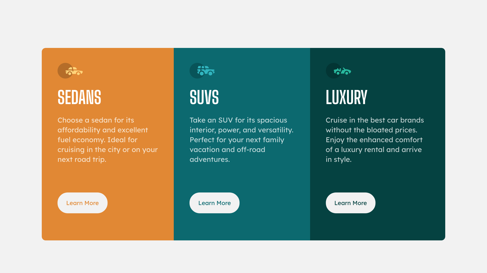
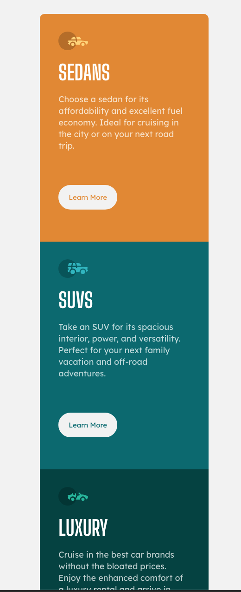

# Frontend Mentor - 3-column preview card component solution

This is a solution to the [3-column preview card component challenge on Frontend Mentor](https://www.frontendmentor.io/challenges/3column-preview-card-component-pH92eAR2-). Frontend Mentor challenges help you improve your coding skills by building realistic projects. 

## Table of contents

- [Overview](#overview)
  - [The challenge](#the-challenge)
  - [Screenshot](#screenshot)
  - [Links](#links)
- [My process](#my-process)
  - [Built with](#built-with)
  - [What I learned](#what-i-learned)
  - [Useful resources](#useful-resources)
- [Author](#author)

## Overview

### The challenge

Users should be able to:

- View the optimal layout depending on their device's screen size
- See hover states for interactive elements

### Screenshot

### Links

- Live Site URL: https://nebiyouersabo.github.io/3-column-card-preview/

## My process

### Built with
- HTML5 
- CSS custom properties
- CSS Flexbox
- Desktop-first workflow

### What I learned
- I learnt more on flexboxs of CSS
- I also learnt new more about media query breakpoints & web responsiveness

## Author
- Instagram: neba_crown (www.instagram.com/neba_crown)

